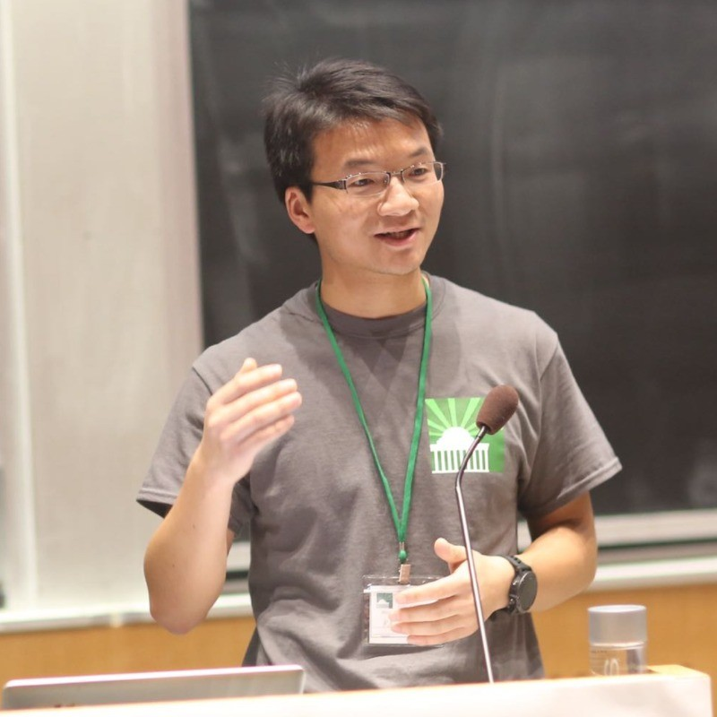

## Hello!

I am working on democratizing intelligence for every company at ByteDance.

Previously, I was a Senior Director at Momenta.ai leading a team of engineers and PMs to build data infra and simulation for autonomous driving. Within my 3 years tenure, we built the largest simulation platform in China in terms of scale from scratch and won "Platform of the Year" in 2022 and 2023.

Prior to Momenta.ai, I was spearheading the strategy of Volcengine at ByteDance. Before that, I was working on investment in AI and Infrastructure. I have also founded/co-founded various startups and organizations, including GGU Consulting, MIT CEO, MIT Energy Hackathon.

### Background

I obtained my PhD from MIT and my bachelors from Tsinghua University.

### Research Interests

- Artificial General Intelligence (AGI)
- Large Language Models
- Energy Storage
- Autonomous Driving

### Personal

During my spare time, I like hiking, running and skiing.

### Contact

Feel free to reach out to me at xiangk07@gmail.com or connect with me on [LinkedIn](https://linkedin.com/in/mitkaixiang) and [Twitter](https://twitter.com/xiang_kai_MIT).